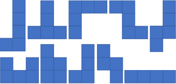
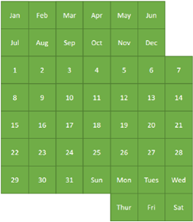
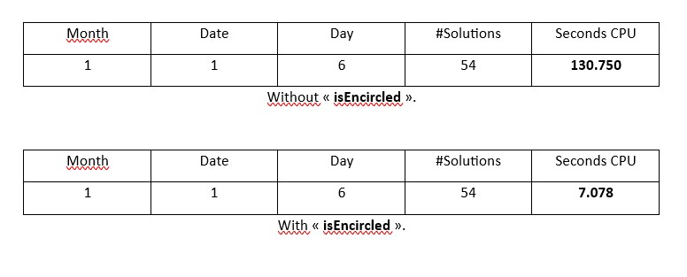
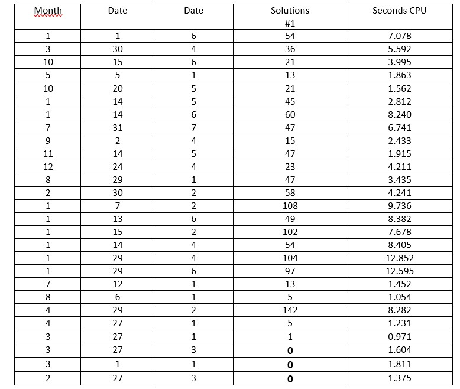
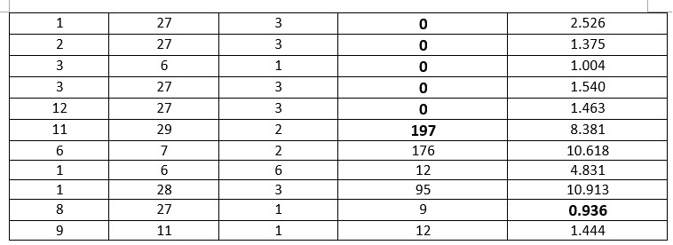

# Complexity & Recursion: Report Gérard Dray's Calendar - 2023

Authors: FORAY Leo Paul, MU Maxime (IMT Mines Alès)  
Date: 26/03/2023

## Table of Contents
1. Introduction  
    1.1 Variables  
    1.2 Value Domain  
    1.3 Constraints  
2. Algorithm  
3. Optimizations  
4. Results and Interpretations  
5. Conclusion  

## 1. Introduction
The objective of this work is to examine the different solutions of the following problem:
 

We are looking for the different possibilities of filling the board on the right with the pieces on the left.
We know that when all the pieces are placed, only three green squares remain uncovered, and we want these three squares to form a date (Month – Day – Day of the week).
Therefore, we would like to find all the possible solutions to this problem, in other words all the possible solutions for each triplet/date, also called instance thereafter.

### 1.1 Variables
For a given instance, the variables that govern the problem are the blue pieces that have translation and rotation properties. Indeed each can be positioned in various places, and can undergo rotations of 90°, 180° and 270° (exception will be made for symmetrical parts).
For the modeling of the problem, one considers the placement of the top left point of the part.

 
So in some cases, like this, there is no blue square in that specific corner. In this model, each part a belonging to the set [1,10] is represented by the triplet (xₐ, yₐ, rₐ) which translates its position on the board according to x and y as well as its rotation.

### 1.2 Value Domain
The domain of values for the variables is defined by the coordinates (xₐ, yₐ) representing the position of each piece in an 8 x 7 dimension plate, as well as the variable rₐ, representing the rotation of each piece with 4 possible values. Therefore, the domain of values for each variable is as follows:
• xₐ ∈ {1, 2, 3, 4, 5, 6, 7, 8}
• yₐ ∈ {1, 2, 3, 4, 5, 6, 7}
• rₐ ∈ {1, 2, 3, 4}

### 1.3 Constraints
The 8x7 size board has 6 blocked squares to which, for each instance, three squares will be added defining the date in which we are interested, i.e. 9 inaccessible squares in all.
Thus, the sum of the unit squares of the green surface must be equal to that of the squares which constitute the blue pieces plus 3 units.
This also reflects the fact that each piece that is placed on the board limits the placement options available for subsequent pieces, as these cannot overlap.
Moreover, it is important to specify that for certain symmetrical parts, there will only be two possible rotations instead of four.

## 2. Algorithm
To solve this problem, we have chosen to use the C language which allows much faster compilation and execution than other higher level languages, such as Python.
First, we implemented a program proposing a recursive approach based on backtracking to solve the Gérard Dray problem.
It defines a game grid of dimensions "ROWSxCOLUMNS (8x7)" called "board" and represented in the form of a two-dimensional array of integers, where empty squares are represented by 0s, obstacles are represented by digits 11 and occupied squares are represented by positive integers corresponding to the part number. This grid represents the board on which the pieces must be placed.
The constants ROWS, COLUMNS, PIECES and ROTATIONS respectively define the number of rows and columns of the game board, the number of different pieces available for the game, and the maximum number of rotations possible for each piece.
As specified above, our pieces are referenced from the top left corner, and are composed of the coordinates of each of the squares making up the piece in relation to this top left corner.

  For example, this piece is represented by {{0, 1}, {1, 1}, {2, 1}, {3, 0}, {3,1}}

Methods used:
- "placePiece" is a method that checks if the piece can be placed from the coordinates (i,j) on the board "board" while respecting the constraints, namely the borders of the board and the presence of the pieces already placed. If it finds that a piece cannot be placed, then it will return a boolean “False”. Otherwise it places the part and returns “True”.

- “removePiece” is a method which consists in removing a piece of the puzzle on the “board” board. It is used to correct an error or to try different combinations of parts to find the optimal solution.

- "isEncircled" is a boolean method which consists in checking if the board "board" contains an isolated 0, i.e. a free space which has not been occupied by a piece. This method greatly optimizes the calculation and execution time of our program.

- "solvePuzzle" is a recursive method that automatically solves a puzzle on the board. In particular, it calls on the “placePiece” methods to place the pieces, “removePiece” to do the backtracking, “isEncircled” to check if the board does not contain an isolated 0.
The function begins by determining the size and number of possible rotations for each piece based on its number. Then she goes through every possible rotation of each piece, then goes through each square of the game board in an attempt to place the piece in that position. If the piece can be placed without overlapping another piece or leaving the board, the function saves this placement and moves on to the next piece. If the part being placed is the last part to be placed, the function increments the total number of solutions found. If it's not the last piece, the function recursively calls "solvePuzzle" with the next piece. Finally, the function removes the piece from the game board to try another position (backtracking).

- "chooseDate" is a method that allows you to choose the dates in format (MONTH, QUANTITY, DAY), it allows you to place the constraints on the "board" plate.
We then tried to solve the problem using an approach other than backtracking. This new method consists of this:
- We browse the table from line to line, always with the top left corner as the origin.

- For each space traveled:

o We try to place all the pieces as well as their rotations.

 - When a piece can be placed on this square:

 - Place the piece on the board.

 - The resolution method is called by recursion, with the new board thus formed, the list of pieces remaining to be placed, and the number of pieces remaining to be placed as parameters.
 - Then we remove this piece from the board, so that the loop can test other possibilities.

 - When all the pieces have been tested, if the box is empty (i.e. if it was not initially locked) the number of solutions found is returned.

 - Otherwise the loop continues its course.

However, this method which should only return unique results, returns duplicate results. If we take the example of Saturday January 1, for which 54 different solutions exist, this method returns 63, but in only 1.23 seconds.
We obviously have duplicates among the solutions, and we were even able to identify 7 pairs that were found each time one after the other. Therefore, we tried to create a backup of the solutions found to add them only once, however after multiple attempts this method does not work, and we therefore do not achieve a relevant result with this algorithm.

## 3. Optimizations
The first program we described above used the brute force approach to solve the problem of placing pieces on the board. Indeed, this method consists in testing all the possible combinations of rotations and positions for each part, then checks if the combination is valid or not. This process is repeated until a valid solution is found. But in our algorithm we have adapted this method so that this approach gives us all possible solutions.
However, this method can be very time-consuming or even inefficient when dealing with large problems.
But this is also the case for our problem, which leaves room for a number of simplifications. For example, if a piece was misplaced at the start (e.g. leaving an isolated 0 at the start, which can never be filled because the pieces are too big), it may take a long time before the algorithm does not change its position and that it fills the 0.
This is why we have created the “isEncircled” method which detects the presence of an isolated 0 on the “board” board. If we manage to detect invalid locations on the game board earlier, it would then be possible to directly inform the algorithm so that it immediately changes the piece in question. This method therefore saves a considerable amount of computation and execution time.

For example :

Thus, one can note the importance of this method thanks to the economy of calculations which it provides.

The advantage of the second solution that we proposed is that the verification of isolated empty cells is directly included in the recursive function: we have added two parameters imin and jmin, which are the coordinates of the cell that made the call.
So we can check from the beginning if the box is empty, and therefore return 0 in this case. We are getting closer to the 54 real solutions with now 57 solutions found, and this in 1.01 seconds. We are now able to find all duplicates in the display, but we still haven't been able to solve this problem.
In the interest of figuring out which part of the loop to create these duplicate solutions, we could include a new case closing the redundant branches, which would further speed up our program.

## 4. Results and Interpretations

We tested our algorithm on the 2,604 possibilities and 19 dates do not have solutions, Tuesday, November 29 is the instance that has the most solutions, with no less than 197 possibilities.

## 5. Conclusion
From our work we can conclude that only 19 instances do not have solutions, which answers our initial problem. However, it is interesting to note that optimizing our programs was the most complex part of the work, since it was unthinkable to solve the problem if each of the instances took 130 seconds. The optimization work here was very important, and although we did not manage to complete this second method to compare performance, the execution time for each instance remains less than 10 seconds.
